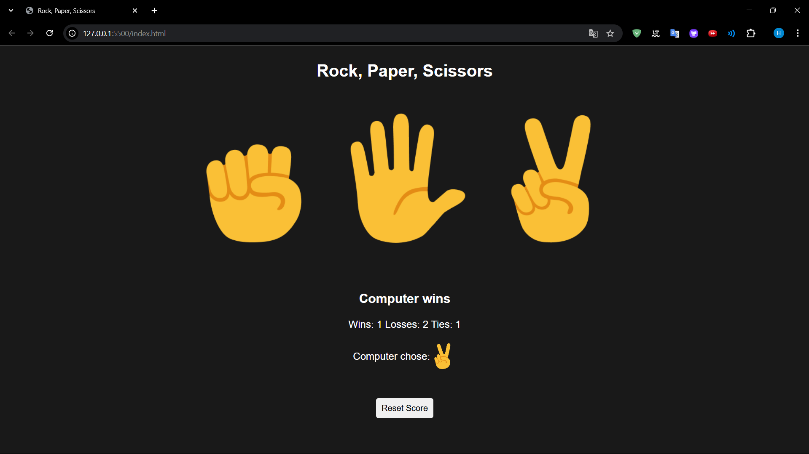

# Rock, Paper, Scissors Oyunu

Bu proje, klasik "Rock, Paper, Scissors" (Taş, Kağıt, Makas) oyununu basit bir şekilde taklit eden bir web uygulamasıdır. Oyuncuların taş, kağıt veya makas seçerek bilgisayara karşı oynadığı bu eğlenceli oyun, kazananları, kaybedenleri ve berabere sonuçları sayar ve skorları kaydeder.

## 📸 Ekran Görüntüleri

### Oyun Arayüzü

*Oyuncunun seçim yapabileceği taş, kağıt ve makas butonları ile birlikte oyun arayüzü.*


## 🚀 Özellikler

- **Kullanıcı Seçimi:** Oyuncuların Taş, Kağıt veya Makas seçebileceği butonlar.
- **Bilgisayar Seçimi:** Bilgisayarın rastgele bir seçim yapması.
- **Skor Takibi:** Oyunun kazananı, kaybedeni ve berabere durumları izlenir.
- **Yerel Depolama:** Skorlar yerel depolama ile kaydedilir, böylece sayfa yenilense bile skorlar korunur.
- **Resetleme:** Skorları sıfırlayarak yeniden başlayabilirsiniz.
  
## 🛠 Kullanılan Teknolojiler

- **Frontend:** HTML, CSS, JavaScript
- **Veri Yönetimi:** LocalStorage (Skorları kaydetmek için)
  
## 📂 Proje Yapısı

### `index.html`
Ana HTML dosyasıdır. Burada, kullanıcı seçimlerini yapabileceği butonlar ve oyun sonuçlarının gösterileceği alanlar bulunur.

### `styles.css`
Oyunun stil dosyasıdır. Butonlar, renkler ve oyun arayüzü için stiller burada tanımlanmıştır.

### `script.js`
Oyunun mantığını içeren dosyadır. Kullanıcı hareketini alır, bilgisayarın seçimini yapar ve sonucu belirler. Skorları günceller ve yerel depolamaya kaydeder.

## 📦 Kurulum

1. Bu projeyi bilgisayarınıza indirin veya bir Git deposuna klonlayın:
   ```bash
   git clone https://github.com/kullaniciadi/rock-paper-scissors.git
   cd rock-paper-scissors
